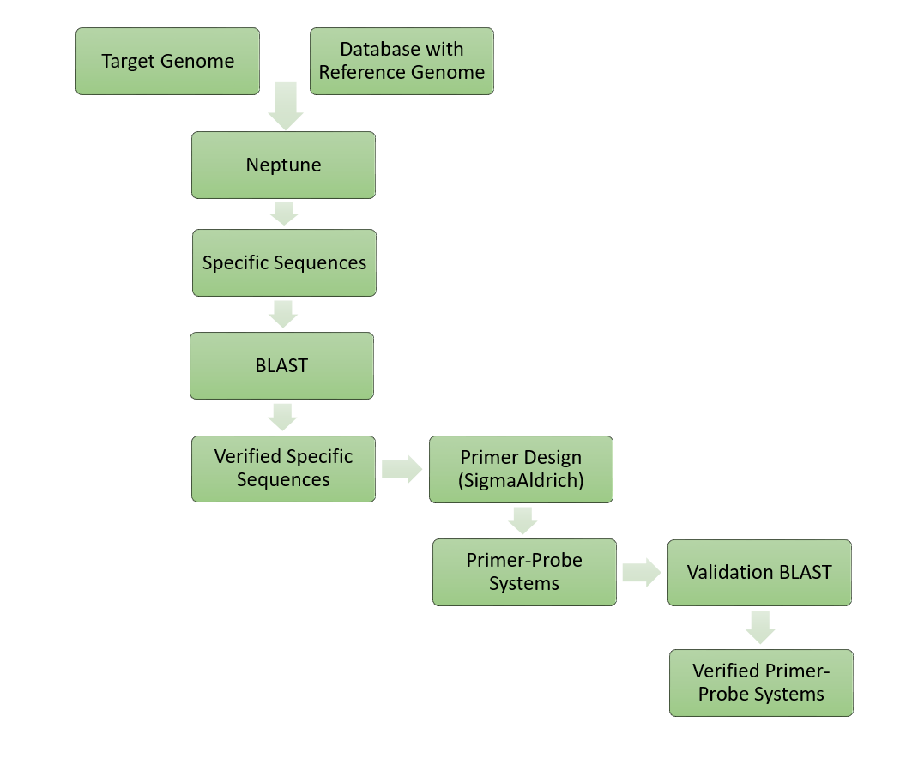

# ssqPCRmf (Strain-specific qPCR Marker Finder) 

This is a simple workflow for designing a primer-target system for monitoring bacterial strains of interest using qPCR. It is built using a minimal amount of freely available command line tools (linux) in combination with web applications. <br>
Starting material is an assembled genome of your strain of interest. A set of reference genomes from related species and strains is required to identify sequence parts in the genome of interest, that are unique for this genome an do not occur in related strains. The unique candidate sequences can be used to design a strain-specific qPCR system.

For paper see: (enter paper upon release)

### Workflow outline


1)	Obtaining set of closely related reference genomes (exclusion geneomes)
2)	Identifying potential strain specific sequences of target genome  to reference genomes using [neptune](https://phac-nml.github.io/neptune/)
3)	Confirming uniqueness of potential sequences using BLAST to nt database (web tool or local)
4)  Primer design with OligoArchitect (web tool)
5)  BLAST validation (optional, web tool)
6)  Experimental validation




### Requirements

- System: The workflow was designed on a Linux 64-bit system and assumes the use of the [BASH](https://en.wikipedia.org/wiki/Bash_(Unix_shell)) unix shell. <br>Downloading and filtering reference genomes can be realized with a set of Linux built in features (sed, awk, grep, ...)

- Neptune: Neptune was used to select candidate sequences that are unique marker for strain of interest. <br>It can be installed using conda, for detailed [installation instruction](https://phac-nml.github.io/neptune/install/) see neptune website (https://phac-nml.github.io/neptune/)

- Storage: Storage requirements are dependent on the set of reference genomes you download. The largest storage will be required by neptune for storing the k-mers, but they can be deleted immediatly after run. <br>
    example: 463 Xanthomonodaceae Genomes with total (unpacked) size of 1.95 Gb. k-mer file: 20Gb

- Memory and CPU: Workflow was run on a high performance cluster, runtime was ~4h for 80CPUs and ~20h using 1 CPU
	<details>

	|   |  nCPUs |  maxRSS |  time (hh:mm:ss) |  
	|---|---|---|---|
	|   |  80 |  95022908K |  04:23:17 |  
	|   | 1  | 67494608K  | 20:51:31  |  
	</details>


## Step 1: Downloading set of reference genomes
First obtain a set of reference genomes related to the genome of interest. We found that the family level is a suitable threshold to select the exclusion genomes. This resulted a sufficient database of related genome sequences and is likely to reveal promising candidate sequences. <br>We use the metadata tables from ncbi's refseq and from [gtdb](https://gtdb.ecogenomic.org/) to filter for related genomes and to make a selection. These tables contain all relevant information and can be searched an filtered using simple bash onliners. Afterwards we can download the selected list of genomes.


### First make a directory to place the reference genomes.

```
mkdir -p 01_Download_Refseq_Genomes
```

### Download the metadata tables from refseq and GTDB 

Download bacterial refseq summary
```
wget -P 01_Download_Refseq_Genomes https://ftp.ncbi.nlm.nih.gov/genomes/refseq/bacteria/assembly_summary.txt
# move to download folder and rename
mv 01_Download_Refseq_Genomes/assembly_summary.txt 01_Download_Refseq_Genomes/assembly_summary_refseq.txt
```

In addition GTDB is needed because refseq summary does not contain full taxonomy. 

```
wget -P 01_Download_Refseq_Genomes https://data.ace.uq.edu.au/public/gtdb/data/releases/release95/95.0/bac120_metadata_r95.tar.gz
# unpack
tar -xzvf 01_Download_Refseq_Genomes/bac120_metadata_r95.tar.gz
# move
mv bac120_metadata_r95.tsv 01_Download_Refseq_Genomes/
```
GTDB might have newer releases, check under https://data.ace.uq.edu.au/public/gtdb/data/releases/ and select the desired version

### Filter for the desired Taxonomy. 

In the following example of the workflow the genome of interest is an assembled strain of *Aureimonas altamirensis* and the exclusion genomes are selected from the family *Xanthomonodaceae*. For different exclusion groups, change the file names and parameters accordingly. 

For selecting all listed genomes from the family of Xanthomonodaceae, the search term would be <code>f__Xanthomonodaceae</code>. You can filter either based on the GTDB taxonomy (use column 17 in gtdb metadata table) or the ncbi taxnomy (use column 79 in gtdb metadata table)
```
# move to genomes directory
cd 01_Download_Refseq_Genomes
# extract based on ncbi taxonomy
cut -f79 bac120_metadata_r95.tsv | grep "f__Xanthomonodaceae" | grep -f - bac120_metadata_r95.tsv > Xanthomonodaceae_selected.tsv
# check number of selected Genomes
wc -l Xanthomonodaceae_selected.tsv
```

### Subset the ncbi metadata table for the selected Genomes
```
cat Xanthomonodaceae_selected.tsv | cut -f55 | grep -f - assembly_summary_refseq.txt > assembly_summary_Xanthomonodaceae.tsv
```

### Prepare download links and download genomes

```
# grep ftb base from column 20 and edit to download links
cut -f20 assembly_summary_Xanthomonodaceae.tsv | while read ftp; do fname=$(echo $ftp | grep -o 'GCF_.*' ); echo $ftp/${fname}_genomic.fna.gz;done > Xanthomonodaceae-refseq-download-links.txt
```
Loop over the download link file to download all Genomes from refseq 

```
cat Xanthomonodaceae-refseq-download-links.txt | while read line; do wget $line; done
```

Optionally you can rename the Genomes. ('GCF_' works only for refseq assembly ids, if you used GenBank insetad, change accordingly)
```
cut -f8,20 assembly_summary_Xanthomonodaceae.tsv | sed 's\ \_\g'  | while read name ftp; do fname=$(echo $ftp | grep -o 'GCF_.*' ); mv ${fname}_genomic.fna.gz ${name}.fna.gz; done 
```

These steps are also available as bash script <code>download-reference-genomes.sh </code>, that can be run with

```
donwload-reference-genomes.sh <family>
```

where family can be set as "Xanthomonodaceae". Selecting on a different taxonomic level requires additional modifications.

## Step 2: Running Neptune

Neptune is a tool that searches for genomic signatures that are present in an inclusion group, but sufficiently absent in an exclusion group, using a k-mer matching strategy. We use it to find genomic sequences within the genome of interest, that discriminate it against all others. 

```
# unpack reference genomes for neptune
gzip -d 01_Download_Refseq_Genomes/*fna.gz
```

```
# run neptune with 20 threads
neptune -i genome_of_interest.fna -e 01_Download_Refseq_Genomes/*.fna -o 02_neptune_output -p 20
```


### 2.1 Filtering neptune results

The final candidates can be found in the folder <code>consolidated</code>, candidate sequences are sorted by overall confidence score. btw, the score from neptune is defined as the ["sum of the in (inclusion/sensitivity) and ex (exclusion/specificity) scores, and represents a combined measure of sensitivity and specificity"](https://phac-nml.github.io/neptune/walkthrough/). 

If you have a lot of candidate sequences, additional filtering steps can be applied to filter sequences by a score threshold, minimum sequence length etc. 

For filtering multi-fasta files by sequences lenght, you can use tools like [seqkit](https://bioinf.shenwei.me/seqkit/), but the same reslts can also be achived with a simple bash onliner:

```
# filtering for a minimum length of 500
awk -v n=500 '/^>/{ if(l>n) print b; b=$0;l=0;next } {l+=length;b=b ORS $0}END{if(l>n) print b }' consolidated.fasta > consolidated-filtered.fasta
```
For filtering the consolidated.fasta file based on a score threshold use the <code>filter-score.sh</code> script.
```
# filtering for a minimum score of 0.97
./filter-score.sh consolidated.fasta 0.97 > consolidated-filtered.fasta
```

## Step 3: Confirming uniqueness of candidate sequences
We blast the candiate sequences to the nt database. This ensures that they are not only unique among the selected reference genomes, but have no high similarities to any other known sequences in the nt database. Confrim this either using the [blastn website ](https://blast.ncbi.nlm.nih.gov/Blast.cgi?PROGRAM=blastn&PAGE_TYPE=BlastSearch&LINK_LOC=blasthome). Or use a local installation of blast+ with a local download of the indexed nt database, see [blast+ manual](https://www.ncbi.nlm.nih.gov/books/NBK279690/) for details.

Best use a sequence with no blast hits for Primer design

<details><summary>For local blast</summary>

```
blastdb=/your/local/nt.blastdb
blastn -query consolidated.fasta \ # use consolidated-filtered.fasta if filering was applied
		-db $blastdb \
		-num_threads 4 \
		-outfmt "6 qseqid sseqid saccver sstart send sseq stitle" \
		-out blast-candidates.blastout \
		-max_target_seqs 1
```

We want to retain all sequences that have no match to the nt database. If the <code>blast-candidates.blastout</code> file is empty, then there are not matches to the db. Congratulations, you can move on to Step 4.
</details>

## Step 4: Primer Design with Oligo Architect

If you have a unique sequence you can use the web tool [OligoArchitect](http://www.oligoarchitect.com/LoginServlet) from Sigma-Aldrich to identify a primer target system.<br>
We performed the search with the recommended parameters: We searched for primers/probes with a length between 17 and 25 bp, PCR products shouldn't be too long to avoid self-dimers and hairpins (<300), annealing temperatures of primers should by slightly under 60°C and for probes slightly under 70°C. 


## Step 5: BLAST Validation
Optionally you can confirm again, that the primers do not target a misleading sequence using blast.


